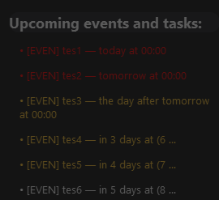

# Wallpaper Calendar

**A semi-transparent desktop calendar widget** that displays upcoming events from Google Calendar and allows quick adding of new events.

---

## 🚀 Features

* **Transparent desktop widget** with a fade-in effect on hover.  
* **Scrollable list** of upcoming events.  
* **Context menu** on the header for settings:  
  - Open settings window  
  - Pin/unpin the widget  
  - Resize or adjust transparency  
* **Add events** directly from the settings window.  
* **System tray icon** for quick access:  
  - Open widget  
  - Open settings  
  - Exit application  
* **Auto-refresh** every 10 minutes.  
* **Embedded Flask server** to handle OAuth and token refresh operations.  
* **Run modes via command line:**  
  - `calendar` — run only the desktop calendar app  
  - `server` — run only the Flask server  
  - `all` — run both calendar and server concurrently  
* **Extensible:** support for local `.ics` files and other event sources.

---

## 📂 Project Structure

```text
wallpaper_calendar/
├── main.py                  # Entry point with argparse to run calendar, server or both
├── server.py                # Flask server handling OAuth and tokens
├── build.py
├── src/
│   ├── ui/
│   │   ├── main_window.py       # Widget window
│   │   ├── settings_window.py   # Settings window
│   │   └── tray.py              # System tray icon
│   ├── core/
│   │   ├── calendar_manager.py  # Google Calendar manager
│   │   └── client_manager.py    # 
|   └── utils/
|       ├── Logger               # Its my custom logger
│       └── __init__.py
├── assets/
│   ├── icon.png             # Tray icon
│   ├── icon.ico             # Application icon
│   ├── style.qss            # QSS styles
|   └── ...                  # Funny XD  
├── pyproject.toml           # Dependency list
└── README.md                # User guide
````

---

## 🖼 Screenshots & Demo

### Preview
  
*How the desktop widget looks on your screen.*

### Usage Video
[](assets/wallpaper-demo.mp4)  
*Click the image to watch the usage demo.*

---

## 🛠 Installation

1. Clone the repository:

   ```bash
   git clone https://github.com/777Chara777/wallpaper_calendar.git
   cd wallpaper_calendar
   ```

2. Create and activate a virtual environment (example for bash):

   ```bash
   python -m venv venv
   source venv/bin/activate
   ```

3. Install dependencies:

   ```bash
   uv sync
   ```

4. Copy `credentials.json` from Google Cloud Console to the project root.

---

## ⚙️ Google Calendar API Setup

1. Go to the [Google Cloud Console](https://console.cloud.google.com/).
2. Create a new project and enable the **Google Calendar API**.
3. Under **Credentials**, create an **OAuth Client ID** for a desktop application.
4. Download the `credentials.json` file and place it in the project root.
5. On the first run, the app will generate a `token.json` after authorization.

---

## ▶️ Running the Application

Run with desired mode:

* **Calendar only (default):**

  ```bash
  uv run main.py --mode calendar
  ```

* **Server only:**

  ```bash
  uv run main.py --mode server --ip 127.0.0.1 --port 5000
  ```

* **Both calendar and server:**

  ```bash
  uv run main.py --mode all
  ```

---

## 📦 Building a Windows .exe

1. Start build file:

   ```bash
   uv run build.py debug  # Use 'debug' argument to build with console (CMD) open for debugging
   ```

2. The built executable `wallpaper-calendar.exe` will be in the `dist/` folder.

---

## 🚧 Future Development

* Support for local `.ics` files via `core/event_parser.py`.
* Integration with other calendars and services.
* UI settings: themes, transparency, fonts.
* Event import/export features.

---

## 🤝 Contribution & License

Pull requests are welcome!
This project is licensed under the MIT License.

---

© 2025 Wallpaper Calendar
